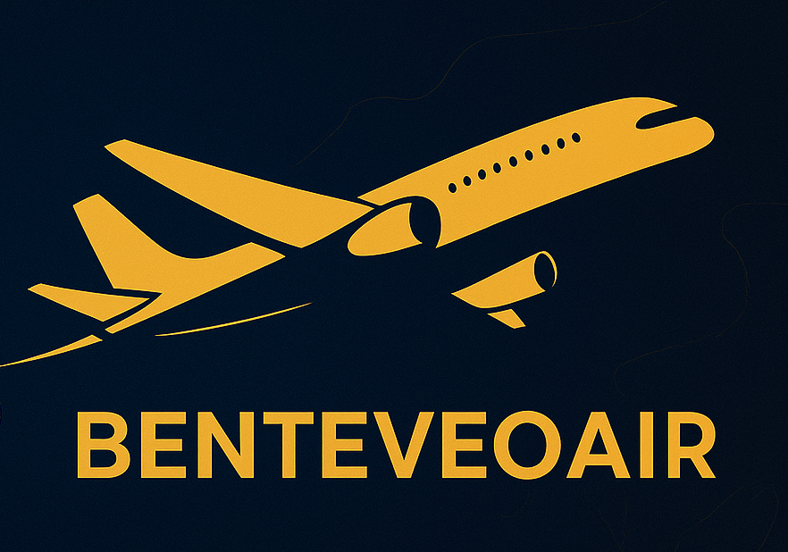

# BenteveoAir – Sistema de Reserva de Vuelos Web

> Proyecto desarrollado por estudiantes de 7ºI para la gestión de reservas de vuelos en línea de forma rápida, intuitiva y moderna.

---

## Descripción del Proyecto

BenteveoAir es una plataforma web que permite a los usuarios registrarse, buscar y reservar vuelos filtrando por origen, destino, fechas y clase. Además, ofrece la posibilidad de seleccionar servicios adicionales, visualizar el precio total y recibir una confirmación inmediata por correo electrónico con todos los detalles del viaje.

Este proyecto simula un sistema completo de reserva de vuelos, incluyendo interfaz gráfica, backend, almacenamiento de datos y comunicación por email.

---

# User Story

## Como cliente registrado en BenteveoAir  
Quiero buscar y reservar vuelos según fechas, destinos y preferencias,  
Para gestionar mis viajes de forma sencilla desde la web y recibir confirmación inmediata con todos los detalles.

---

## Criterios a cumplir

1. El cliente puede iniciar sesión o registrarse para acceder a la funcionalidad de reserva.
2. El cliente puede buscar vuelos filtrando por origen, destino, fechas y clase (económica, business).
3. El sistema muestra una lista clara y ordenada de los vuelos disponibles que coinciden con la búsqueda.
4. El cliente puede seleccionar un vuelo y agregar servicios adicionales (por ejemplo: catering, equipaje extra).
5. El cliente visualiza el precio total actualizado antes de confirmar la reserva.
6. El cliente puede completar la reserva y elegir entre varias opciones de pago seguras.
7. El sistema envía un correo electrónico de confirmación con todos los detalles de la reserva, incluyendo vuelo, precio y servicios seleccionados.
8. El cliente puede consultar su historial de reservas y el estado de cada una desde su perfil.

---

**Diseño grafico:**  
- La interfaz debe ser intuitiva y responsiva para facilitar la experiencia de usuario.  
- Se debe garantizar la seguridad de los datos personales y de pago.

## Funcionalidades Principales

- Registro e inicio de sesión de usuarios
- Búsqueda de vuelos por fecha, destino, clase
- Selección de vuelo y servicios adicionales (equipaje, catering, etc.)
- Cálculo y visualización de precio total actualizado
- Reserva con opciones de pago
- Envío de confirmación por correo electrónico
- Visualización de historial de reservas

---

## Tecnologías Utilizadas

- HTML, CSS y JavaScript (Frontend)
- Node.js / Express (Backend)
- Postgre (Base de datos)
- api (Confirmación por email)
- Git y GitHub (Control de versiones)

---

## Equipo de Desarrollo – Curso 7ºI

| Nombre                   | Rol                  |
|--------------------------|-----------------------|
| Pablo Daniel Santellán   | Líder de Proyecto     |
| Axel Zavaleta            | Programador           |
| Esteban Terrazas         | Analista de Datos     |
| Valentina Bernasconi     | Diseñadora Gráfica    |

---

## Cronograma del Proyecto

El proyecto fue planificado con una duración de 8 días, iniciando el 27 de junio de 2025 y finalizando el 4 de julio de 2025.

---

---
## Diagrama Base de datos

---
